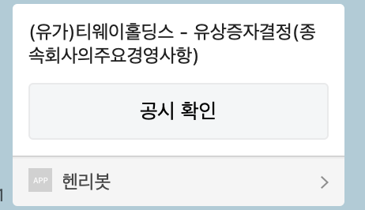

# feed_dart
[DART](http://dart.fss.or.kr/)에서 제공하는 최근 공시 데이터를 파싱합니다.
원하는 특정 키워드가 담긴 피드와 관련 링크를 카카오톡 나에게 메세지 보내기 api를 사용하여 메세지를 보낼 수 있습니다.

DART에서는 RSS로 최근 공시 정보를 제공하고 있습니다. [링크](http://dart.fss.or.kr/api/todayRSS.xml)

공시 시간은 유가 증권시장 기준 월-금, 07:30 - 19:00까지로 스케줄러를 해당 시간에 맞춰 사용해주세요.

관심 기업은 favorite.json으로 "key":[] 형식으로 생성해주세요.
``` favorite.json
{
  "key": ["삼성전자", "포스코", "셀트리온"]
}
```

## prerequisite
python 3.8 환경에서 테스트하고 실행을 확인하였습니다.

1. python 라이브러리
```
다음 라이브러리를 추가 설치해야 합니다.

pip install feedparser
pip install requests
```

2. 카카오 메세지 - 나에게 기본 메세지 보내기
카카오 메세지 api는 토큰 기반의 인증을 사용하고 있습니다. 토큰을 발급받아 사용해주세요.
```
    header = {"Authorization": 'Bearer {token}'}
```

카카오 메세지 api는 카카오 디벨로퍼에서 신청 후 사용할 수 있습니다.
카카오 기본 가이드에 대한 내용은 문서에서 확인해주세요.
- [카카오 디벨로퍼스 기본 가이드](https://developers.kakao.com/docs)
- [나에게 기본 메세지 보내기](https://developers.kakao.com/docs/latest/ko/message/rest-api#send-me)
- [토큰 받기](https://developers.kakao.com/docs/latest/ko/kakaologin/rest-api#request-token)

3. aws lambda
aws lambda는 선택입니다. lambda는 심플하지만 강력한 도구로 사용해보세요.

- [클라우드워치 이벤트](https://docs.aws.amazon.com/ko_kr/AmazonCloudWatch/latest/events/WhatIsCloudWatchEvents.html)
- [클라우드워치 cron 표현식](https://docs.aws.amazon.com/AmazonCloudWatch/latest/events/ScheduledEvents.html)
- [python으로 lambda 함수 빌드](https://docs.aws.amazon.com/ko_kr/lambda/latest/dg/lambda-python.html)
- [python 3.8에서 lambda 함수 만들기](https://docs.aws.amazon.com/ko_kr/lambda/latest/dg/python-package-create.html)

```
1. cd sorbitol
2. pip install --target ./package requests
3. pip install --target ./package feedparser
4. cd package
5. zip -r ../sorbitol.zip .
6. cd ..
7. zip -g sorbitol.zip lambda_function.py
8. zip -g sorbitol.zip favorite.json
```

## 로컬 사용법 (mac)

```
1. crontab -e
2. */30 7-19 * * 1-5 python lambda_function.py
```

or

```
python lambda_function.py
```

## 메세지


